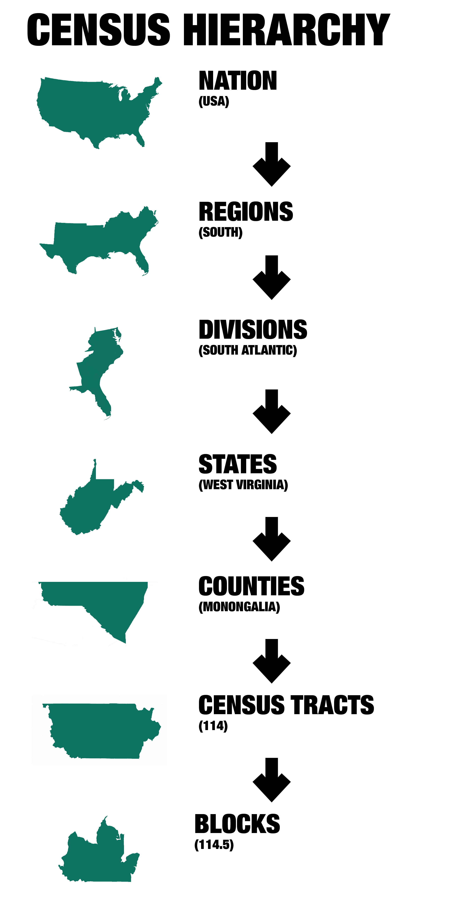

# Learning Resources

This workshop was developed using the following resources:

-   [Kyle Walker - Census Data Workshop - University of Michigan
    2022](https://github.com/walkerke/umich-workshop-2022)

-   Walker, K. (2023). *Analyzing US census data: Methods, maps, and
    models in R*. CRC Press. <https://doi.org/10.1201/9780203711415>

# Requirements

### Install Packages

```{r scrape install, eval=FALSE,  message=FALSE}

install.packages("tidycensus")
install.packages("tidyverse")
install.packages("sf")
install.packages("tigris")

```

### Load Packages

```{r scrape load, eval=FALSE,  message=FALSE}

library(tidycensus)
library(tidyverse)
library(sf)
library(tigris)

```

### Set your working directory

```{r setwd, eval=FALSE}

setwd()

```

### Set your API key

```{r cenus key, eval=FALSE, message=FALSE}

census_api_key("", install = TRUE, overwrite = TRUE)

```

------------------------------------------------------------------------

# About Tidycensus

**tidycensus** is an R package that allows users to interface with a
select number of the US Census Bureau\'s data APIs and return
tidyverse-ready data frames, optionally with simple feature geometry
included.

-   [tidycensus documentation](https://walker-data.com/tidycensus/)

------------------------------------------------------------------------

# Decennial Census Data

This is the demographic census of the United States which takes place
once every 10 years as mandated by Article I, Section 2 of the
Constitution. The Decennial Census determines the number of House of
Representative seats assigned to States as well the redistricting of
state legislative districts.

### Function: get_decennial()

the
[get_decennial()](https://walker-data.com/tidycensus/reference/get_decennial.html)
function allow us to obtain data and feature geometry for the decennial
US Census

data sets available:

-   1990

-   2000

-   2010

-   2020

    ```{r example, eval = FALSE}

    # data on the hispanic population by state

    hispanic_by_state <- get_decennial(
      geography = "state",
      variables = "P2_002N",
      year = 2020)
    hispanic_by_state
    ```

---

{width="250"}

---

### Census Regions in Tidycensus

| Geography                                                       | Definition                                                                        | Available by      | Available in                   |
|-----------------|-----------------------|----------------|----------------|
| "us"                                                            | United States                                                                     |                   | get_acs ( ) , get_decennial( ) |
| "region"                                                        | Census region                                                                     |                   | get_acs ( ) , get_decennial( ) |
| "division"                                                      | Census division                                                                   |                   | get_acs ( ) , get_decennial( ) |
| "state"                                                         | State or equivalent                                                               | state             | get_acs ( ) , get_decennial( ) |
| "county"                                                        | County or equivalent                                                              | state, county     | get_acs ( ) , get_decennial( ) |
| "county subdivision"                                            | County subdivision                                                                | **state**, county | get_acs ( ) , get_decennial( ) |
| "tract"                                                         | Census tract                                                                      | **state**, county | get_acs ( ) , get_decennial( ) |
| "block group"                                                   | Census block group                                                                | **state**, county | get_acs ( ) , get_decennial( ) |
| "block"                                                         | Census block                                                                      | **state, county** | get_decennial( )               |
| "place"                                                         | Census designated place                                                           | state             | get_acs ( ) , get_decennial( ) |
| "alaska native regional corporation"                            | Alaska native regional corporation                                                | state             | get_acs ( ) , get_decennial( ) |
| "american indian area/ alaska native area / hawaiian home land" | Federal and state-recognized American Indian reservations and Hawaiian home lands | state             | get_acs ( ) , get_decennial( ) |

: geography in tidycensus; If **state** or **county** is in bold face;
you are required to supply a state and/or county for the given geography

---

### Call decennial data from a region

```{r county example, eval=FALSE}

wv_hispanic <- get_decennial(
  geography = "county",
  variables = "P2_002N",
  state = "WV",
  year = 2020
)

wv_hispanic

```

---

# American Community Survey (ACS) Data

The ACS is a survey issued by the US Census Bureau that covers one (1)
and five (5) year estimates. This survey provides detailed population
and housing information about the United States and has variable not
covered in the Decennial Cenus.

### Function: get_acs()

the
[get_acs()](https://walker-data.com/tidycensus/reference/get_acs.html)
function allows us to obtain data and feature geometry for the American
Community Survey

-   The get_acs() function in tidycensus allows you to access ACS data
    from 2005 through 2020.

-   Other required arguments: geography, for the level of aggregation,
    and variables, for one or more ACS variables

-   get_acs() defaults to the 5-year ACS with the argument survey =
    "acs5"; survey = "acs1" is used for 1-year ACS data

```{r acs example, eval=FALSE}

wv_hispanic_acs <- get_acs(
  geography = "county",
  variables = "B03001_001",
  state = "WV",
  year = 2020,
  survey = "acs5"
)

wv_hispanic_acs

```

# Variables in ACS and Decennial Census

We can view what variables are available using the load_variables()
function. We can open those variables in a new tab using the view()
function. That tab will allow us to search the variables.

```{r variables, eval=FALSE}

vars20 <- load_variables(2020, "pl")

vars10 <- load_variables(2010, "pl" )

acs_vars20 <- load_variables(2020, "acs5")

view(acs_vars20)

```

### Variables and Tables

call data from full tables versus individual variables

-   [Table Codes in Decennial
    Census](%22https://www.census.gov/programs-surveys/decennial-census/about/rdo/summary-files.html%22)

-   [Table Codes in
    ACS](%22https://www.census.gov/programs-surveys/acs/data/data-tables/table-ids-explained.html%22)

```{r tables, eval=FALSE}

wv_quarters <- get_decennial(
  geography = "state",
  table = "P5",
  year = 2020,
  output = "wide"
)

wv_quarters

```

------------------------------------------------------------------------

# Tidy and Wide outputs

### Tidy format

By default tidycensus outputs that data in a tidy format where variables
are stacked by row

```{r wide, eval=FALSE}

group_quarters <- get_decennial(
  geography = "state",
  table = "P5",
  year = 2020
)
group_quarters
```

### Wide format

Setting data as "wide" - one row per geographic unite and one column per
variables

```{r wide data, eval=FALSE}

group_quarters_wide <- get_decennial(
  geography = "state",
  table = "P5",
  year = 2020,
  output = "wide"
)
group_quarters_wide
```

------------------------------------------------------------------------

# Renaming Census Variables

### Vector

call data with multiple variables using vectors

```{r renaming census id variables, eval=FALSE}

vacancies_wide <- get_decennial(
  geography = "county",
  state = "WV",
  variables = c(vacant_households = "H1_003N",
                total_households = "H1_001N"),
  year = 2020,
  output = "wide"
)
vacancies_wide

```

### Objects

create a object containing vector of combined variables

```{r race variables, eval=FALSE}

race_vars <- c(
  Hispanic = "P2_002N",
  White = "P2_005N",
  Black = "P2_006N",
  Native = "P2_007N",
  Asian = "P2_008N",
  HIPI = "P2_009N"
)

```

call data with multiple variables using objects

```{r multiple variables object, eval = FALSE}

wv_race <- get_decennial(
  geography = "block",
  state = "WV",
  variables = race_vars,
  year = 2020,
  output = "wide"
)

wv_race

```

------------------------------------------------------------------------

# Tidyverse

the [**tidyverse package**](%22https://www.tidyverse.org/%22) provides
functions that allows for data cleaning, data manipulation, and data
visualization.

*note: tidyverse works best with tidy format over wide format*

### Function: Filter, Arrange, and Select

the [**filter()
function**](%22https://dplyr.tidyverse.org/reference/filter.html%22)
allows us to filter out observations in a variable, based on criteria
that we establish.

the [**arrange()
function**](%22https://dplyr.tidyverse.org/reference/arrange.html%22)
allows us to sort observations in a variable, based on criteria that we
establish

the [**select()
function**](%22https://dplyr.tidyverse.org/reference/select.html%22)
allows us to remove variables from a data frame

```{r county size example, eval=FALSE}

# example: using filter and arrange functions to view largest and smallest counties in IL

# get the data set

il_population <- get_decennial(
  geography = "county",
  variables = (total_population = "P1_001N"),
  year = 2020,
  state = "IL"
)
il_population

# arrange by smallest - total population 

arrange(il_population, value)

# arrange by largest - total population

arrange(il_population, desc(value))

# find counties with population less than 7000 and show only the county name and population total

below10k <- il_population %>% 
  filter(value < 10000) %>%
  select(NAME, value) %>% 
  arrange(desc(value))
below10k
```

### Summary variables

-   Many decennial Census and ACS variables are organized in tables in
    which the first variable represents a *summary variable*, or
    denominator for the others

-   The parameter summary_var can be used to generate a new column in
    long-form data for a requested denominator, which works well for
    normalizing estimates

```{r summary variables, eval=FALSE}

wv_race <- get_decennial(
  geography = "county",
  state = "WV",
  variables = race_vars,
  summary_var = "P2_001N",
  year = 2020
)
arrange(wv_race, NAME)

```

### Function: Mutate

the
[**mutate()**](%22https://dplyr.tidyverse.org/reference/mutate.html%22)
function allows you to create new variables based of of existing
observations in your data frame

```{r mutate and select, eval=FALSE}

#using mutate and select to get percentages

wv_race_percent <- wv_race %>% 
  mutate(percent = round(100* (value/summary_value), digits = 2)) %>% 
  select(NAME, variable, percent)


arrange(wv_race_percent, NAME)

wv_race_percent
```

### Function: Group By and Summarise

the
[**group_by()**](%22https://dplyr.tidyverse.org/reference/group_by.html%22)
and
[**summarise()**](%22https://dplyr.tidyverse.org/reference/summarise.html%22)
functions allow us to group observations in a categorical variable and
get descriptive statistics of these groups.

```{r group by and summarise, eval=FALSE}

# get mean percent of Monongalia and Preston County races

mon_race_by_group <- wv_race_percent %>% 
  filter(NAME == "Monongalia County, West Virginia" | NAME == "Preston County, West Virginia") %>% 
  group_by(variable) %>% 
  summarise(mean_pct = mean(percent))
mon_race_by_group


```

### Function: Join and Rename

the
[**join()**](%22https://dplyr.tidyverse.org/reference/mutate-joins.html%22)
function allows us to join two data frames together based on a
comparable variable.

the
[**rename()**](%22https://dplyr.tidyverse.org/reference/rename.html%22)
function allows us to rename variables.

```{r 2010 variables, eval=FALSE}

# comparing 2010 and 2020 census data using the join() function

#view 2010 variables

vars10 <- load_variables(2010, "pl")
view(vars10)

# get 2010 county population statistics

county_pop_10 <- get_decennial(
  geography = "county",
  variables = "P001001",
  state = "WV", 
  year = 2010
)
county_pop_10

#clean 2010 data

county_pop_10_clean <- county_pop_10 %>% 
  select(GEOID, value10 = value)

# clean 2020 data

county_pop_20 <- get_decennial(
  geography = "county",
  variables = "P1_001N",
  state = "WV", 
  year = 2020
) %>% 
  select(GEOID, NAME, value20 = value)

# joining the 2010 and 2020 data

county_joined <- county_pop_20 %>% 
  left_join(county_pop_10_clean, by = "GEOID") %>% 
  rename("County" = NAME, "2020" = value20, "2010" = value10) %>% 
  select(-GEOID)

county_joined

summary(county_joined)


```

### NA Test

county and boundary names can change over time. check to see if there is
any missing data

```{r is na check, eval=FALSE}

county_na_check <- which(is.na(county_joined))
county_na_check
```

------------------------------------------------------------------------

# Data Visualization

we can use the [**ggplot2**](%22https://ggplot2.tidyverse.org/%22)
package in Tidyverse to plot data

```{r race by county, eval=FALSE}

# race by county in West Virginia

wv_race_wide <- get_decennial(
  geography = "county",
  state = "WV",
  variables = race_vars,
  summary_var = "P2_001N",
  year = 2020,
  output = "wide"
) %>% mutate(percent_white = 100 * (White / summary_value), 
             percent_black = 100 * (Black / summary_value))

wv_race_wide

```

### Histogram

We can visualize the distribution of a variable using the
[**geom_histogram()**](%22https://ggplot2.tidyverse.org/reference/geom_histogram.html%22)
function.

```{r histogram, eval=FALSE}

wv.hist <- ggplot(wv_race_wide, aes(percent_black))

wv.hist + geom_histogram(bins = 10)

```

### Scatterplot

We can visualize the distributions of two quantitative variables using
the
[\*\*geom_point()](%22https://ggplot2.tidyverse.org/reference/geom_point.html%22)
function and we can find the trend lines using the
[\*\*geom_smooth()](%22https://ggplot2.tidyverse.org/reference/geom_smooth.html%22)
function

```{r scatterplot, eval=FALSE}

options(scipen = 999)

wv.scatter <- ggplot(wv_race_wide, aes(x=summary_value, y = percent_black))

wv.scatter + geom_point() +
  geom_smooth(method = "lm")
 
#Changing a scale from linear to logarithmic can help with exploratory visualization when data is heavily skewed due to baseline variance

wv.scatter + geom_point() +
   scale_x_log10() +
  geom_smooth(method = "lm")

```

### Bar graph

We can visualize the number of cases in variables using the
[**geom_col()**](%22https://ggplot2.tidyverse.org/reference/geom_bar.html%22)
function.

```{r wv income data, eval=FALSE}

# get the data from ACS

wv_income <- get_acs(
  geography = "county",
  variables = "B19013_001",
  state = "WV",
  year = 2020
)

wv_income <- wv_income %>% 
  mutate(NAME = str_remove(NAME, " County, West Virginia")) %>% 
  filter(estimate > 50000)
wv_income

# Create a bar graph

wv_income.bar <- ggplot(wv_income, aes(x = estimate, 
                                       y = reorder(NAME, estimate)))

wv_income.bar + geom_col() +
  labs(title = "Median Household Income",
       subtitle = "Counties West Virginia",
       x = "ACS Estimate",
       y = NULL) +
  theme_minimal() +
  scale_x_continuous(labels = scales::dollar_format(scale = .001, suffix = "K"))

```

------------------------------------------------------------------------

# Spatial data

### Census TIGER/Line shape files

{width="150"}

TIGER/Line shape files are geographic datasets released by US Census
bureau that can be accessed using the **tigris package**

How tigris works When you call a tigris function, it does the following:

-   Downloads your data from the US Census Bureau website;

-   Stores your data in a temporary directory by default;

-   Loads your data into R as a simple features object using
    sf::st_read()

```{r cache tigris files, eval=FALSE}

#cache downloaded shapefiles and prevent having to re-download every time you use them

options(tigris_use_cache = TRUE)

```

```{r tigris files, eval=FALSE}

# set the data

wv_counties <- counties(state = "WV")
wv_counties

# plot the data

plot(wv_counties$geometry)

```

### The sf package

the [**simple features package**](%22https://r-spatial.github.io/sf/%22)
allows us to map data onto features

```{r sf, eval=FALSE, message=FALSE}

install.packages("sf")
library(sf)

```

### Available Datasets in tigris

-   Legal entities: units that have legal significance in the US (e.g.
    states, counties)

-   Statistical entities: units that are used to tabulate Census data
    but do not have legal standing (e.g. Census tracts or block groups)

-   Geographic features: other geographic datasets provided by the
    Census Bureau that are not used for demographic tabulation (e.g.
    roads, water)

### Polygons: statistical entities

```{r statistical, eval=FALSE}

mon_tracts = tracts(state = "WV", county = "Monongalia")
plot(mon_tracts$geometry)

```

### Lines: geographic features

```{r geographic, eval=FALSE}

mon_roads = roads(state = "WV", county = "Monongalia")
plot(mon_roads$geometry)

```

### Points: geographic features

```{r landmarks, eval=FALSE}

dc_landmarks <- tigris::landmarks("DC", type = "point")
plot(dc_landmarks$geometry)


```

### Arguments in tigris files

-   cb = cartography boundaries true/false

-   year = year of shapefile (goes back to 1990 census)

------------------------------------------------------------------------

### Mapping Census Data onto Features

```{r mapping with tigris, eval=FALSE}

# adding geometry = TRUE allows for mapping data

wv_population <- get_decennial(
  geography = "county",
  variables = "P1_001N",
  state = "WV",
  year = 2020,
  geometry = TRUE
)

wv_population

#using the plot function will place the value onto the feature

plot(wv_population["value"])

```

### Spatial data with ggplot2

We can map spatial data in ggplot using the
[**geom_sf()**](%22https://ggplot2.tidyverse.org/reference/ggsf.html%22)

```{r ggplot spatial, eval=FALSE}

wv.map <- ggplot(wv_population, aes(fill = value))

wv.map + geom_sf()

```
